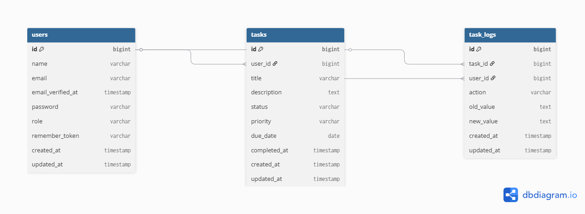

# 📋 Task Management System

<p align="center">


</p>

---

# 🚀 Overview

A modern **Task Management System** built with **Laravel 11** following **Clean Architecture** principles and Laravel best practices.

The application enables users to manage their daily tasks efficiently through an intuitive dashboard, RESTful APIs, role-based authorization, automatic notifications, audit logging, and real-time statistics.

This project was developed to demonstrate professional backend development practices using Laravel.

---

# 🎯 Project Goals

- Apply Laravel Best Practices
- Build a scalable CRUD application
- Implement Repository Pattern
- Implement Service Layer
- Build RESTful APIs
- Authentication with Laravel Sanctum
- Authorization using Policies & Roles
- Event-Driven Architecture
- Unit & Feature Testing

---

# ✨ Features

## 👤 Authentication

- User Registration
- User Login
- Secure Logout
- Laravel Sanctum Authentication
- Form Request Validation

---

## 👥 User Management

- User Profile
- Role-Based Access Control
- Admin Permissions
- Authorization Policies

---

## ✅ Task Management

- Create Tasks
- Update Tasks
- Delete Tasks
- View All Tasks
- Search Tasks
- Filter Tasks
- Pagination
- Due Date Management
- Priority Levels
- Status Management
- One-click Task Completion

---

## 📊 Dashboard

- Total Tasks
- Pending Tasks
- Completed Tasks
- Overdue Tasks
- Completion Percentage
- Recent Tasks
- Task Statistics

---

## 🔔 Notifications

- Task Created Notification
- Event & Listener Architecture

---

## 📝 Audit Logs

Automatically records:

- Task Created
- Task Updated
- Task Deleted
- Task Completed

---

## 🔐 Security

- Laravel Sanctum
- Authorization Policies
- Middleware Protection
- Validation
- CSRF Protection
- Mass Assignment Protection

---

## ⚡ Performance

- Repository Pattern
- Service Layer
- Database Indexing
- Query Optimization
- Eager Loading
- Cache System

---

# 🏗️ Architecture

```
                Controller
                     │
                     ▼
              Service Layer
                     │
                     ▼
           Repository Layer
                     │
                     ▼
             Eloquent Models
                     │
                     ▼
                 MySQL Database
```

The project follows:

- Repository Pattern
- Service Layer
- SOLID Principles
- Clean Code
- Dependency Injection
- Event-Driven Design

---

# 🛠 Tech Stack

| Technology | Version |
|------------|----------|
| Laravel | 11 |
| PHP | 8.2+ |
| MySQL | 8 |
| Laravel Sanctum | Latest |
| Spatie Permission | Latest |
| Tailwind CSS | 3 |
| Blade | Latest |
| PHPUnit | Latest |
| Scribe API Documentation | Latest |

---

# 📂 Project Structure

```
app/
│
├── Events/
├── Http/
│   ├── Controllers/
│   ├── Middleware/
│   └── Requests/
│
├── Listeners/
├── Models/
├── Notifications/
├── Policies/
├── Providers/
│
├── Repositories/
│   ├── Contracts/
│   ├── Eloquent/
│   └── Services/
│
database/
│
├── migrations/
├── seeders/
│
tests/
│
├── Feature/
└── Unit/
│
docs/
routes/
config/
```

---

# 📡 REST API

| Method | Endpoint | Description |
|---------|-----------|-------------|
| POST | `/api/register` | Register |
| POST | `/api/login` | Login |
| POST | `/api/logout` | Logout |
| GET | `/api/tasks` | Get Tasks |
| POST | `/api/tasks` | Create Task |
| GET | `/api/tasks/{id}` | Show Task |
| PUT | `/api/tasks/{id}` | Update Task |
| DELETE | `/api/tasks/{id}` | Delete Task |

---

# 🚀 Installation

Clone the repository

```bash
git clone https://github.com/Yoe2004-25/Task-Management-System-Laravel.git
```

Go to project folder

```bash
cd Task-Management-System-Laravel
```

Install dependencies

```bash
composer install
```

Create environment file

```bash
cp .env.example .env
```

Generate application key

```bash
php artisan key:generate
```

Configure your database inside `.env`

```env
DB_CONNECTION=mysql
DB_HOST=127.0.0.1
DB_PORT=3307
DB_DATABASE=task
DB_USERNAME=root
DB_PASSWORD=
```

Run migrations

```bash
php artisan migrate --seed
```

Start the development server

```bash
php artisan serve
```

---

# 🧪 Running Tests

Run all tests

```bash
php artisan test
```

---

# 📸 Screenshots

## Dashboard

> Add a screenshot here

```
docs/dashboard.png
```

```markdown

```

---

## API Documentation

> Generated using Scribe

```
docs/api-documentation.png
```

```markdown

```

---

## Database ER Diagram

```
docs/ERD.png
```

```markdown

```

---

# 📖 API Documentation

API documentation is generated automatically using **Laravel Scribe**.

---

# 📈 Future Improvements

- Email Notifications
- Docker Support
- CI/CD Pipeline
- Real-Time Notifications
- Team Collaboration
- File Attachments
- Activity Timeline
- Dark Mode

---

# 💡 Design Patterns Used

- Repository Pattern
- Service Pattern
- Dependency Injection
- Policy Authorization
- Events & Listeners
- Form Request Validation

---

# 📚 What I Learned

- Building scalable Laravel applications
- Repository & Service Pattern
- REST API Design
- Authentication with Sanctum
- Authorization with Policies
- Event-Driven Programming
- Unit & Feature Testing
- Clean Architecture
- Query Optimization
- Professional Project Structure

---

# 👨‍💻 Author

## Youssif Ahmed

Backend Laravel Developer

- 💼 Backend Developer (Laravel)
- 🌱 Passionate about Clean Architecture & REST APIs
- 📚 Always learning new backend technologies

### GitHub

https://github.com/Yoe2004-25

---

# ⭐ Support

If you found this project useful, consider giving it a **⭐ Star** on GitHub.
